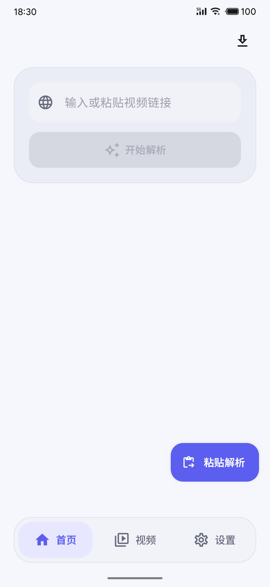
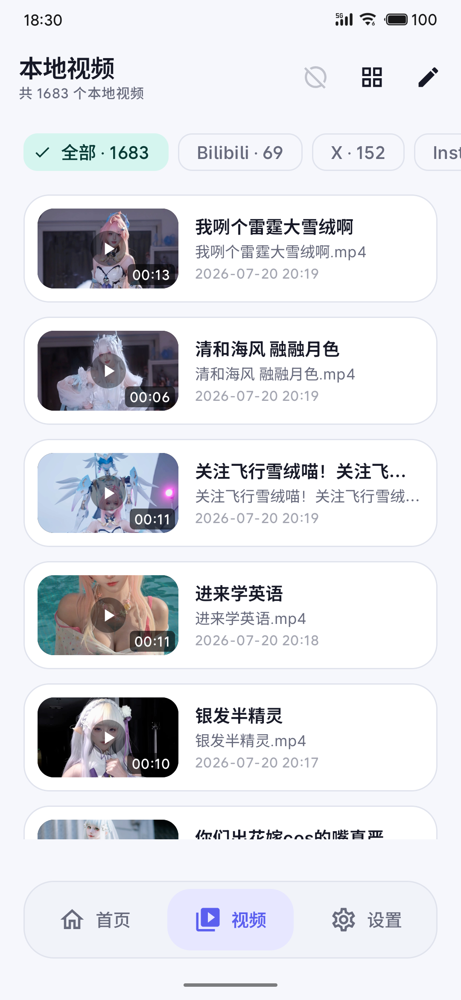
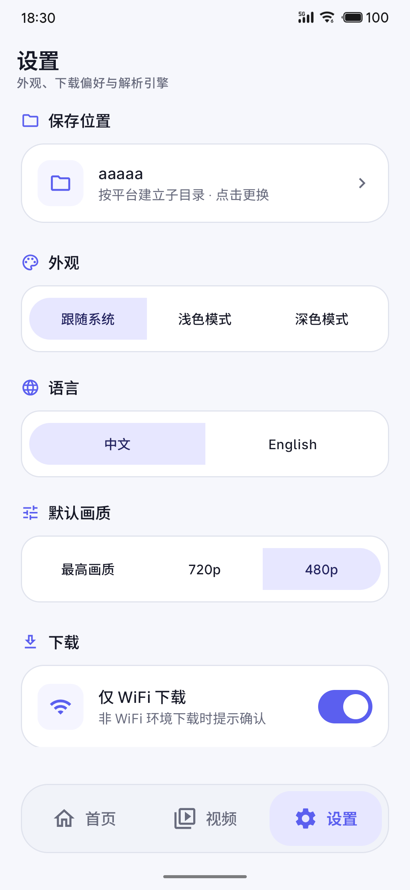

# Video Downloader

[简体中文](README.md) | **English**

An Android application for parsing, downloading, and managing videos, built with Kotlin and Jetpack Compose. It extracts downloadable media from public video page links, lets users select a quality, saves files to a user-selected folder, and manages downloads and local videos inside the app.

## Features

- Parse public links from Bilibili, X / Twitter, Instagram, YouTube, and other supported sites.
- View the thumbnail, title, format, quality, and estimated file size before downloading.
- Select a save folder through Android's Storage Access Framework (SAF), without legacy storage permissions.
- Run downloads in the background with progress tracking, individual pause/resume, and pause/resume all controls.
- Resume partial downloads, restore tasks after restarting the app, and long-press to select and remove tasks.
- Create platform-specific folders automatically and scan existing videos in the selected folder.
- Browse local videos in list, two-column, or three-column layouts and play them inside the app.
- Use light mode, dark mode, or follow the system theme.
- Choose Chinese or English on first launch and switch languages later in Settings.
- Update the yt-dlp parsing engine from the Settings screen.

## Screenshots

<table>
  <tr>
    <th>Home</th>
    <th>Videos</th>
    <th>Settings</th>
  </tr>
  <tr>
    <td></td>
    <td></td>
    <td></td>
  </tr>
</table>

## Parsing Strategy

The app uses dedicated parsers first and falls back to yt-dlp for compatibility:

| Platform | Preferred parser | Fallback |
| --- | --- | --- |
| Bilibili | Native API parser | yt-dlp |
| X / Twitter | Dedicated API parser | yt-dlp |
| Instagram | Anonymous public-content parser | yt-dlp |
| YouTube and other compatible sites | yt-dlp | Detailed error message |

Some content may not be available because of sign-in requirements, regional or age restrictions, private visibility, platform API changes, or expired links. The app does not provide account sign-in or cookie management.

## How to Use

1. Open **Settings** and select a video save folder.
2. Paste a public video page link on the Home screen and start parsing.
3. Select the required quality or format and confirm the download.
4. Tap the download icon in the upper-right corner of the Home screen to view task progress.
5. Open **Videos** to browse, play, and manage local videos.

Tap a download task to pause or resume it. Use the buttons in the top bar to control all tasks. Long-press a task to enter multi-select deletion mode. Removing a task record does not automatically delete a partially written file.

## Requirements

- Android 10 (API 29) or later.
- The current build includes the `arm64-v8a` ABI only.
- Parsing and downloading require a network connection.
- Some background download scenarios require notification permission. Denying it does not block ordinary downloads, but Android may hide download notifications.

## Tech Stack

- Kotlin and Java 11
- Jetpack Compose and Material 3
- ViewModel, StateFlow, and DataStore
- WorkManager
- Android DocumentFile / SAF
- Media3 ExoPlayer
- OkHttp
- yt-dlp Android and FFmpeg
- Coil and Coil Video

## Project Structure

```text
app/src/main/java/com/example/videodownload/
├─ data/          Data models, settings, and download record persistence
├─ downloader/    Background downloads, progress updates, and SAF file output
├─ navigation/    Screen navigation and the bottom navigation bar
├─ parser/        Dedicated site parsers and the yt-dlp fallback
├─ ui/
│  ├─ home/       Home, download tasks, local videos, and the player
│  ├─ settings/   Settings screen
│  └─ theme/      Material 3 themes and colors
└─ util/          URL normalization, platform detection, and other utilities
```

JVM tests are located in `app/src/test/`, and device tests are in `app/src/androidTest/`. Dependency versions are managed in `gradle/libs.versions.toml`.

## Build Locally

Use an Android Studio version compatible with the current Android Gradle Plugin and install Android SDK 36. The project compiles with Java 11 or later.

Windows:

```powershell
.\gradlew.bat assembleDebug
```

macOS or Linux:

```bash
./gradlew assembleDebug
```

The generated debug APK is located at:

```text
app/build/outputs/apk/debug/app-debug.apk
```

## Tests and Checks

```powershell
# Run JVM unit tests
.\gradlew.bat test

# Run Android Lint
.\gradlew.bat lint

# Build the release APK
.\gradlew.bat assembleRelease

# Run device tests with a connected device or emulator
.\gradlew.bat connectedAndroidTest
```

Release signing can be configured with the following Gradle properties:

```properties
RELEASE_STORE_FILE=/path/to/keystore
RELEASE_STORE_PASSWORD=your_store_password
RELEASE_KEY_ALIAS=your_key_alias
RELEASE_KEY_PASSWORD=your_key_password
```

Do not commit signing files, passwords, cookies, downloaded user content, or real account data.

## Privacy and Responsible Use

- Settings, download tasks, and video records are stored locally on the device.
- Access to the save folder is granted by the user through Android's system folder picker.
- Parsing and downloading connect directly to the relevant platform or endpoints required by the parsing engine.
- Only download content you own or are authorized to use, and comply with platform terms and applicable laws.

## Known Limitations

- Private, sign-in-only, region-restricted, or age-restricted content usually cannot be parsed directly.
- Dedicated parsers may temporarily stop working after a platform changes its website or API. Updating yt-dlp may help.
- Some servers do not support HTTP Range requests, so interrupted downloads may not resume from their previous progress.
- The current release configuration targets 64-bit ARM Android devices only.

## License

This project is open-sourced under the [Apache License 2.0](LICENSE). You are free to use, modify, and distribute it, provided the copyright and license notices are retained. Third-party dependencies (Jetpack Compose, OkHttp, Media3, Coil, yt-dlp Android, etc.) remain under their respective licenses.

